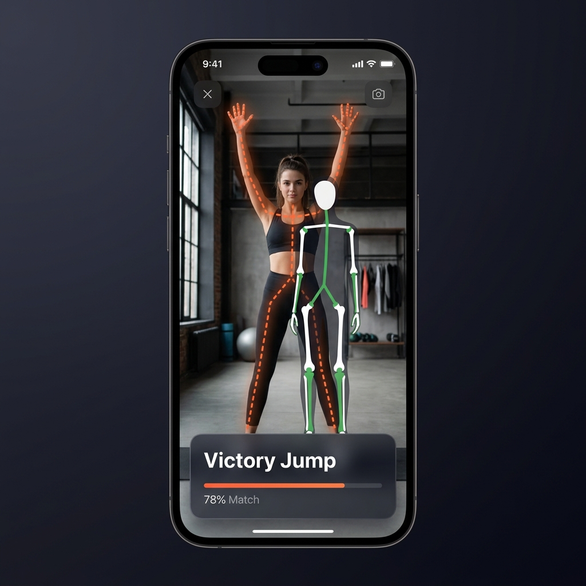
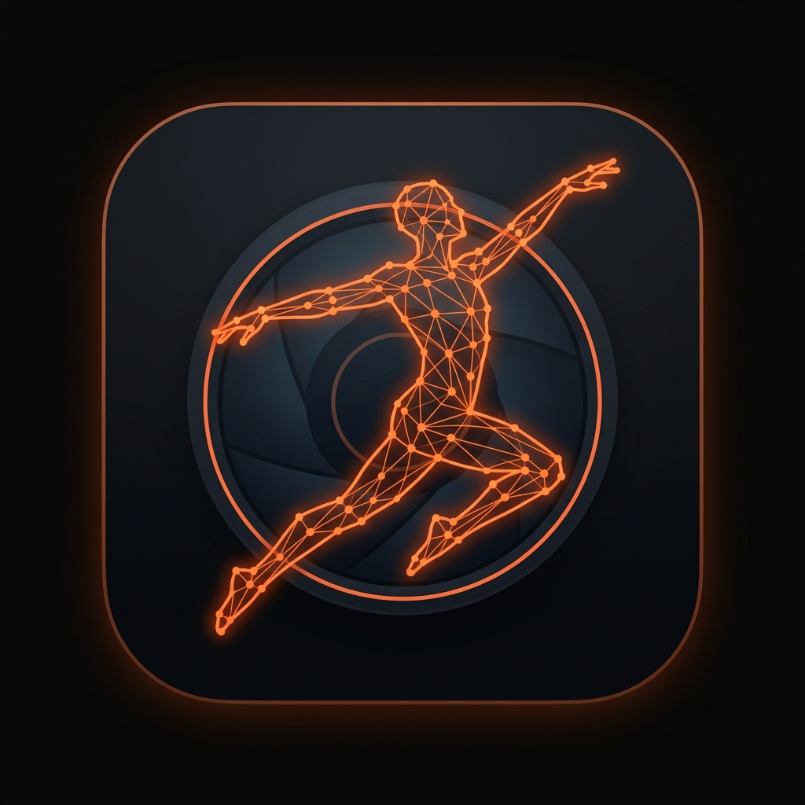

# 📸 PoseSnap AR



**PoseSnap AR** is a premium, real-time AR pose-matching camera app that overlays AI-powered skeleton guides onto your camera feed — just like Huawei's camera pose suggestion feature. Match the target pose, see your match percentage in real-time, and capture the perfect shot.

## ✨ Features

*   **Real-time AI Skeleton Tracking**: Uses TensorFlow.js with MoveNet (SinglePose Lightning) to detect 17 body keypoints at 30fps directly in the browser/WebView.
*   **AR Pose Overlay**: Glowing orange dashed skeleton shows the target pose, while your actual body is tracked with solid white/green lines — all rendered on HTML5 Canvas.
*   **Live Match Scoring**: Real-time match percentage calculated using bounding-box-normalized keypoint distance comparison. Score turns green at 78%+ and triggers a success burst animation at 82%+.
*   **18 Curated Poses Across 6 Locations**: Beach 🏖️, Mountain ⛰️, Café ☕, City 🏙️, Park 🌿, and Night 🌃 — each with 3 unique, photographer-approved poses.
*   **Photo Capture**: 📸 button captures the current frame with skeleton overlay, complete with flash effect and haptic feedback.
*   **Premium Dark UI**: Glassmorphic cards, smooth spring animations, Inter typography, frosted-glass overlays, and micro-interactions throughout.
*   **Mobile-First Design**: Touch-optimized with 44px+ touch targets, swipe gestures to change poses, safe area insets, and screen wake lock.
*   **Camera Flip**: Seamless front/back camera switching with proper mirroring for selfie mode.

## 📱 App Icon



## 🛠️ Tech Stack & Architecture

*   **ML Engine**: TensorFlow.js 4.10.0 + MoveNet SinglePose Lightning (WebGL/WASM/CPU fallback)
*   **Rendering**: HTML5 Canvas 2D with real-time video compositing + skeleton overlay
*   **UI Framework**: Vanilla HTML/CSS/JS — zero framework overhead for maximum performance
*   **Build Tool**: Vite 8.x (fast HMR, optimized production builds)
*   **Mobile Wrapper**: Capacitor 8.x (native Android/iOS shell with WebView)
*   **Styling**: Custom CSS with design tokens, glassmorphism, CSS animations, Google Fonts (Inter)
*   **Package ID**: `com.posesnap.ar`

## 📂 Project Structure

```
POSE SNAP/
├── index.html              # App entry point
├── src/
│   ├── main.js             # Core app logic (camera, ML, drawing, gestures)
│   ├── poses.js            # 18 pose definitions across 6 locations
│   └── style.css           # Premium dark theme (614 lines of polished CSS)
├── dist/                   # Production build output
├── android/                # Native Android project (Capacitor)
├── capacitor.config.json   # Capacitor configuration
├── vite.config.js          # Vite build configuration
├── package.json            # Dependencies & scripts
├── app-icon.png            # App icon
├── preview.png             # App preview screenshot
└── PoseSnapAR.html         # Original single-file prototype
```

## 🚀 Quick Start

### Run in Browser (Development)
```bash
# Install dependencies
npm install

# Start dev server (accessible on LAN for mobile testing)
npm run dev

# Open http://localhost:5173 on your device
```

### Build for Production
```bash
# Build optimized assets
npm run build

# Preview production build
npm run preview
```

### Build Android APK
```bash
# Sync web assets to Android project
npx cap sync android

# Open in Android Studio
npx cap open android

# Then: Run ▶ in Android Studio to deploy to your device
```

## 📲 Testing on Phone (Without Android Studio)

1. Run `npm run dev` on your PC
2. Connect your phone to the **same WiFi** network
3. Open `http://<YOUR-PC-IP>:5173` in your phone's browser
4. Allow camera access when prompted
5. Strike a pose! 🕺

## 🎯 How It Works

1. **Select a Location** — Choose from 6 themed categories on the home screen
2. **See the Target Pose** — An orange dashed skeleton appears on your camera feed
3. **Match It** — Move your body to align with the target skeleton
4. **Watch Your Score** — Real-time match percentage bar tracks how close you are
5. **Capture at 82%+** — A green success burst appears when you nail it — tap 📸 to save!

## 🔧 Pose Detection Pipeline

```
Camera Feed → TensorFlow.js MoveNet → 17 Keypoints
     ↓                                      ↓
Canvas Render ← Skeleton Drawing ← Bounding-Box Normalization
     ↓                                      ↓
Live Display  ← Match % Calculation ← Keypoint Distance Comparison
```

## 📋 Permissions Required

| Permission | Purpose |
|-----------|---------|
| **Camera** | Real-time body pose detection via MoveNet |
| **Wake Lock** | Prevents screen dimming during pose sessions |
| **Vibration** | Haptic feedback on successful pose match |

## 🎨 Design System

| Token | Value | Usage |
|-------|-------|-------|
| `--accent` | `#FF6B35` | Primary orange — buttons, highlights, skeleton |
| `--accent2` | `#FFB347` | Secondary warm — gradients |
| `--bg` | `#080808` | Deep black background |
| `--card` | `rgba(9,9,9,0.94)` | Glassmorphic card backgrounds |
| `--success` | `#4CAF50` | Match success — 78%+ score color |
| `--text` | `#f0ece4` | Primary text — warm white |

---

*Built with TensorFlow.js, Capacitor, and obsessive attention to UI detail.*
